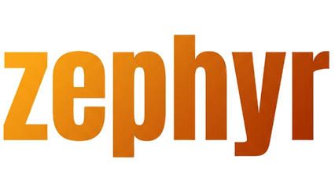
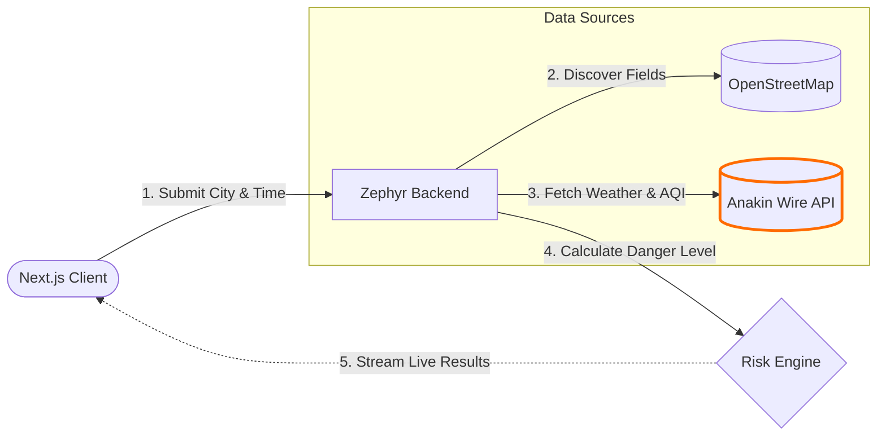

  

 

### **The missing alarm for youth sports.**
Zephyr joins youth sports schedules with hyperlocal heat and air-quality conditions, flagging every practice about to happen in dangerous conditions - in time for a coach or parent to act.

 

### **Current Implementation**

The core application (**Heat Shield**) is fully functional and performs live sweeps of sports venues based on a given city, sport, and time.

*   **Venue Discovery:** We leverage the OpenStreetMap (OSM) Overpass API to dynamically discover football, soccer, baseball, and generic sports fields/stadiums within a specified geographic area.
*   **Environmental Data:** We use the Anakin Wire API to retrieve highly localized weather (temperature, humidity) and air quality (AQI, PM2.5) data for the exact coordinates of each discovered venue.
*   **Risk Scoring:** The Heat Index is calculated and combined with the Air Quality Index. A "Fusion Score" is then generated using National Weather Service (NWS) bands. An optional "Preseason conditioning" modifier artificially elevates the risk tier to account for unacclimated athletes.
*   **Real-time Streaming:** As each venue is scored by the background worker, the results are streamed back to the Next.js client via Server-Sent Events (SSE). This allows the UI to update the map and flag dangerous fields instantly without waiting for the entire region to be processed.

 

### **Architectural Diagram**

 

### **Features thinking of and will be built if time permits:**

*   **AED Gap Map:** A swarm that scrapes youth sports venues, schools, and public AED registries across a region to map which fields/gyms have a working, accessible AED — and flags the dangerous gaps for leagues to fix.
*   **Youth Sports Access Finder:** Swarm-scrape every free/subsidized youth program, scholarship, adaptive-sports league, and equipment-donation drive across a region into one map matched to a family's location, budget, and their child's needs.
