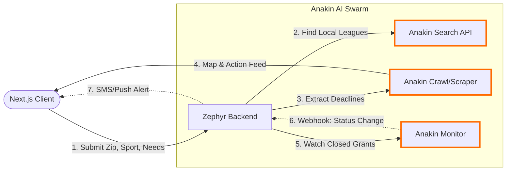

<div align="center">
  
</div>

<br />

### **The missing alarm for youth sports.**
Zephyr joins youth sports schedules with hyperlocal heat and air-quality conditions, flagging every practice about to happen in dangerous conditions - in time for a coach or parent to act.

<br />

### **Current Implementation**

The core application (**Heat Shield**) is fully functional and performs live sweeps of sports venues based on a given city, sport, and time.

*   **Venue Discovery:** We leverage the OpenStreetMap (OSM) Overpass API to dynamically discover football, soccer, baseball, and generic sports fields/stadiums within a specified geographic area.
*   **Environmental Data:** We use the Anakin Wire API to retrieve highly localized weather (temperature, humidity) and air quality (AQI, PM2.5) data for the exact coordinates of each discovered venue.
*   **Risk Scoring:** The Heat Index is calculated and combined with the Air Quality Index. A "Fusion Score" is then generated using National Weather Service (NWS) bands. An optional "Preseason conditioning" modifier artificially elevates the risk tier to account for unacclimated athletes.
*   **Real-time Streaming:** As each venue is scored by the background worker, the results are streamed back to the Next.js client via Server-Sent Events (SSE). This allows the UI to update the map and flag dangerous fields instantly without waiting for the entire region to be processed.

<br />

### **Architectural Diagram**


**How the flow works under the hood:**

1. **Submit City & Time:**
   The Next.js Client captures the user's input and sends a `POST` request to the backend `/api/sweep` route with the following JSON payload:
   ```json
   {
     "city": "Austin, Texas, United States",
     "sport": "Football",
     "time": "4 PM",
     "dayOffset": 0,
     "limit": 10
   }
   ```

2. **Discover Fields (OpenStreetMap):**
   The backend resolves the city to a geographic bounding box and dispatches a `POST` request to `https://overpass-api.de/api/interpreter`. The payload is a raw Overpass Query Language (OQL) script configured to output JSON:
   ```text
   [out:json][timeout:25];
   node["leisure"="pitch"]["sport"="american_football"](south,west,north,east);
   way["leisure"="pitch"]["sport"="american_football"](south,west,north,east);
   out center;
   ```
   This dynamically locates the physical venues and returns a structured list of exact `{ "lat": 30.26, "lon": -97.74 }` coordinates.

3. **Fetch Weather & AQI (Anakin Wire API):**
   For each discovered coordinate, the backend fires parallel tasks to Anakin. It sends `POST https://anakin.io/v1/wire/task` requests authenticated with `Authorization: Bearer <API_KEY>`.
   * **Weather Request Payload:**
     ```json
     {
       "action": "om_forecast",
       "params": {
         "latitude": 30.2672,
         "longitude": -97.7431,
         "hourly": "temperature_2m,relative_humidity_2m"
       }
     }
     ```
   * **Air Quality Request Payload:**
     ```json
     {
       "action": "om_air_quality",
       "params": {
         "latitude": 30.2672,
         "longitude": -97.7431,
         "hourly": "pm2_5,us_aqi"
       }
     }
     ```
   The backend then polls `GET /wire/jobs/{id}` until the asynchronous Anakin worker returns the completed environmental data matrix.

4. **Calculate Danger Level:**
   Our Risk Engine parses the Anakin responses, extracts the specific hourly data point matching the practice time, and calculates the true Heat Index. This is fused with the US AQI. The combined metrics are evaluated against the National Weather Service (NWS) safety bands to assign a `danger_tier` (Safe, Caution, High, Extreme). An optional "Preseason conditioning" toggle artificially elevates the risk tier by one level to account for unacclimated athletes.

5. **Stream Live Results (SSE):**
   To deliver a lightning-fast experience without waiting for all fields to process, the backend utilizes **Server-Sent Events**. It establishes a persistent HTTP connection using the following headers:
   ```http
   Content-Type: text/event-stream
   Cache-Control: no-cache
   Connection: keep-alive
   ```
   The millisecond a venue is scored by the Risk Engine, its result is written to the stream as a raw text chunk:
   ```text
   data: {"id":123,"name":"House Park","lat":30.27,"lon":-97.75,"danger_tier":3,"heat_index":104,"aqi":45}
   
   ```
   The client intercepts these chunks via the native `EventSource` API, parsing each line and instantly dropping a color-coded pin onto the live map.


<br />

---

### **Feature: Youth Access Finder**
Youth sports have become too expensive, pricing out millions of families. The tragedy is that funding and free gear actually exist, but the data is fragmented across thousands of messy local Parks & Rec sites, Pop Warner PDFs, and hidden foundation pages. 

The **Youth Access Finder** is a centralized command center that uses Anakin AI to swarm the internet, extract hidden grants, and match users to hyper-local funding instantly.

#### **Architectural Diagram**



#### **How the Swarm works under the hood:**

1. **Discovery (Anakin Search API):** 
   Instead of manually hunting for clubs, the backend hits `POST https://anakin.io/v1/search`. We pass a dynamic query like `("youth football" OR "Pop Warner") AND "financial aid" AND "Austin, TX"`. Anakin Search returns the exact URLs of local leagues offering assistance.
2. **Extraction (Anakin Crawl / Universal Scraper):**
   The backend feeds those discovered URLs into `POST https://anakin.io/v1/wire/task` using Anakin's Universal Scraper wire. We provide a custom LLM instruction: *"Extract the income eligibility requirements, the exact deadline date, and the application link."* The messy websites are parsed and returned as clean JSON.
3. **The Results Output:**
   The Next.js client renders a map showing glowing pins for Open Scholarships (Purple) and Gear Drives (Green). The user sees a scrollable feed of tactical cards with 1-click "Apply Now" buttons linking directly to the forms Anakin found.
4. **Automated Alerting (Anakin Monitor):**
   If a highly coveted grant (like the NFL FLAG Winter League) is currently marked as "Closed," the user clicks a "🔔 Alert Me" button. The backend registers that specific URL with `POST https://anakin.io/v1/monitors`. 
5. **The Magic Notification:**
   Months later, the millisecond the local league updates their website to say *"Applications Open"*, Anakin Monitor fires a webhook to Zephyr. Zephyr instantly sends an SMS to the user: *"Zephyr Alert: Winter grants just opened in your area! Apply fast before funds run out."*
